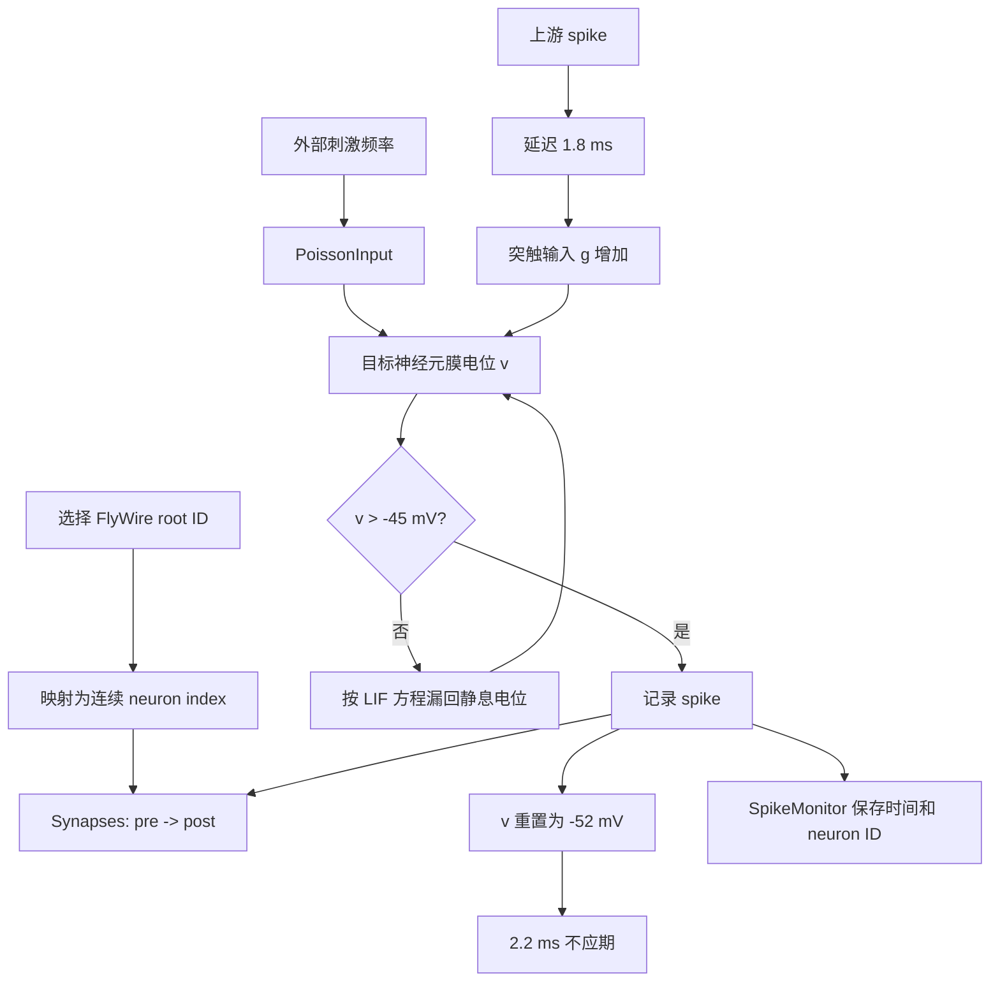

# `Drosophila_brain_model`：刺激与放电流程



## 一次时间步发生什么

1. `PoissonInput` 以指定平均频率给被激活神经元注入随机 spike。
2. 每个 spike 沿 `Synapses` 的有向边传播。
3. 传播先等待固定突触延迟，再增加突触电流变量 `g`。
4. 膜电位 `v` 根据输入上升，同时向静息电位泄漏。
5. 当 `v` 超过阈值，Brian2 记录一个 spike。
6. 神经元重置，进入不应期；该 spike 又会作为下游神经元的输入。

## 本次实验中的含义

```text
5 个 LC4 + 5 个 LPLC2
        ↓ 150 Hz PoissonInput
官方 Brian2 LIF 网络
        ↓
两个 DNp01 的 spike
```

这里的 150 Hz 是人工刺激，不是从真实视频直接推导出的放电率；DNp01 spike 是神经活动读出，不等同于已经完成逃逸动作。

## 官方与我们的分工

| 环节 | 来源 |
|---|---|
| 神经元列表、边和连接计数 | 官方 FlyWire v783 表 |
| LIF 方程、阈值、重置、不应期 | 官方 `model.py` |
| Poisson 激活和沉默接口 | 官方 `model.py` |
| 选哪 5 个 LC4/LPLC2 | 本实验脚本 |
| 提取局部一跳子图 | 本实验脚本 |
| DNp01 汇总和图表 | 本实验脚本 |

## Spike 是什么

`spike`（动作电位或放电事件）是神经元向下游发送的一次离散事件。在这个模型里，连续变化的是膜电位 `v`；当 `v` 超过阈值 `-45 mV` 时，Brian2 记录一个 spike，然后把 `v` 重置到 `-52 mV`，并在 `2.2 ms` 内进入不应期。这个 spike 沿着该神经元的所有出边传播，经过 `1.8 ms` 延迟后让下游的 `g` 增加。因而 spike 不是“一个持续的电压波形”，而是模型用来传递神经活动的时间戳事件。

## 这个仓库目前实现了什么

官方 `Drosophila_brain_model` 是一个**静态连接组 + 简化电动力学**模型：

1. 用 FlyWire 的 root ID 和连接表建立有向突触图。
2. 用 LIF 方程让每个节点随时间更新膜电位。
3. 用 `PoissonInput` 人工产生输入 spike，模拟固定频率的光遗传激活。
4. 用 `Synapses.on_pre='g += w'` 把上游 spike 变成下游突触输入。
5. 用 `SpikeMonitor` 输出各神经元的 spike 时间和编号。

仓库 README 明确提供的操控只有两类：activation 和 silencing。activation 是对指定神经元注入固定频率的随机 Poisson spike；silencing 是把指定神经元的入边和出边权重置零。它没有在当前 `model.py` 中实现突触学习、STDP、短时程突触变化、递质浓度动力学或多巴胺受体状态。

## 电信号之外可以怎样扩展

生物系统里，神经活动不只有“spike 沿突触传递”这一层。对我们的数字模型，可以把额外机制拆成接口，而不是混进 LIF 方程：

| 机制 | 数字化接口 | 当前官方仓库 |
|---|---|---|
| 神经调质（如多巴胺） | `dopamine[cell_or_region, t]` 浓度/脉冲状态；调节阈值、突触权重或电流 | 未实现 |
| 突触可塑性 | 每条边的 `w(t)` 更新规则，例如 STDP 或奖励调制 | 未实现；当前 `w` 初始化后固定 |
| 短时程突触动力学 | 每条边增加 `x/u` 等释放概率和资源变量 | 未实现 |
| 受体/离子通道状态 | 增加慢变量，调节电流或阈值 | 未实现；当前只有 `v`、`g`、不应期 |
| 感觉刺激编码 | 图像/光流 → 感光神经元输入率或电流 | LIF 仓库未实现；`flyvis` 负责这一层 |
| 内部状态/行为反馈 | 身体状态或奖励 → 调质信号/输入闭环 | LIF 仓库未实现 |

一个最小的多巴胺实验可以保持连接组和 LIF 参数不变，只增加一条“调质通道”：在时间窗 `t_reward` 给某个多巴胺变量一个脉冲，并令候选边的权重按 `w <- w + eta * dopamine * eligibility` 更新。这样可以严格比较“无多巴胺”和“有多巴胺”两次运行；但这会成为我们自己的扩展模型，不应再称为官方原始 LIF 结果。

## 与当前实验的关系

当前 LC4/LPLC2 → DNp01 实验只检验一件事：**给定一小段真实连接组，在人工输入下，活动能否经过突触传播并在 DNp01 产生 spike。** 它还没有检验学习、奖励、记忆或自然视觉刺激。下一步安装并运行 `flyvis` 后，实验链会把输入从“直接激活 LC4/LPLC2”推进到“视觉刺激 → 视觉网络响应”；多巴胺和可塑性应作为后续对照模块单独加入。
