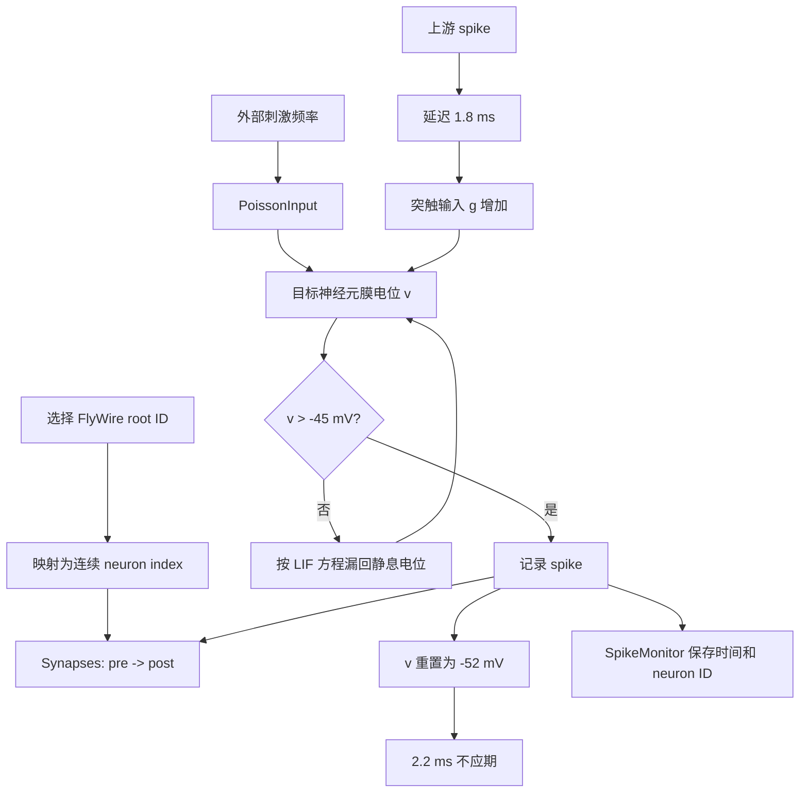

# `Drosophila_brain_model`：刺激与放电流程



## 一次时间步发生什么

1. `PoissonInput` 以指定平均频率给被激活神经元注入随机 spike。
2. 每个 spike 沿 `Synapses` 的有向边传播。
3. 传播先等待固定突触延迟，再增加突触电流变量 `g`。
4. 膜电位 `v` 根据输入上升，同时向静息电位泄漏。
5. 当 `v` 超过阈值，Brian2 记录一个 spike。
6. 神经元重置，进入不应期；该 spike 又会作为下游神经元的输入。

## 本次实验中的含义

```text
5 个 LC4 + 5 个 LPLC2
        ↓ 150 Hz PoissonInput
官方 Brian2 LIF 网络
        ↓
两个 DNp01 的 spike
```

这里的 150 Hz 是人工刺激，不是从真实视频直接推导出的放电率；DNp01 spike 是神经活动读出，不等同于已经完成逃逸动作。

## 官方与我们的分工

| 环节 | 来源 |
|---|---|
| 神经元列表、边和连接计数 | 官方 FlyWire v783 表 |
| LIF 方程、阈值、重置、不应期 | 官方 `model.py` |
| Poisson 激活和沉默接口 | 官方 `model.py` |
| 选哪 5 个 LC4/LPLC2 | 本实验脚本 |
| 提取局部一跳子图 | 本实验脚本 |
| DNp01 汇总和图表 | 本实验脚本 |

