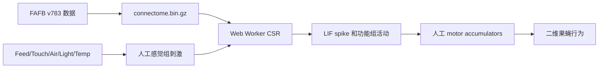
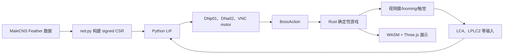
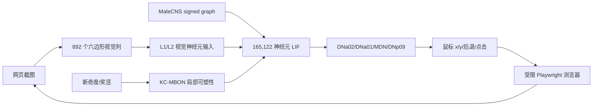
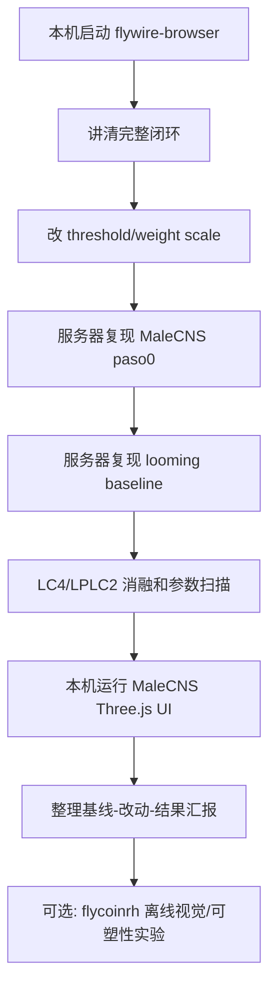

# 三个开源项目怎样使用果蝇连接组

核对日期：2026-09-15。三个项目均为第三方项目，不是 Janelia、FlyWire Consortium 或相关论文作者发布的官方模拟器。`fruitflydev/flycoinrh` 是 `flybrain.online` 所展示系统的主要公开实现，但其 README 同样明确声明不隶属于数据发布机构。

## 总流程


连接组只直接提供 A-B。C-J 都包含项目作者的建模选择，因此实验必须记录输入映射、动力学参数、输出映射和训练过程。

## 项目对比

| 本地目录 | 数据 | 动力学 | 环境 | 最适合做什么 | 首选运行位置 |
|---|---|---|---|---|---|
| `external/flywire-browser` | FlyWire FAFB v783，139,255 神经元 | 浏览器 Web Worker LIF；另有手工聚合功能网络 | 浏览器二维果蝇 | 快速理解、现场展示、改阈值观察 | 本机 |
| `external/malecns-game` | MaleCNS v1.0，约 16.5 万神经元 | Python 稀疏 LIF；部分实验训练细胞类型 gain/threshold | Rust + WASM + Three.js 游戏 | looming 逃逸、消融、参数扫描 | UI 本机；实验服务器 |
| `external/flycoinrh` | MaleCNS v1.0，165,122 神经元、10,228,000 条筛选边 | CPU/GPU LIF、细胞类型 gain、蘑菇体可塑性 | Playwright 真实浏览器、网页和链上应用 | 研究视觉到鼠标控制及在线学习 | 离线实验服务器 |

## 1. FlyWire 浏览器模拟

固定版本：见项目根目录的 `.gitmodules` 和 submodule commit。



关键代码：

- `js/sim-worker.js`：全连接组 LIF，默认 leak `0.95`、threshold `1.0`、refractory `3`、weight scale `0.15`；
- `js/connectome.js`：功能组刺激、内部 drive、阈值传播和 motor accumulator；
- `js/fly-logic.js`：把运动累计量转成画面中的速度和转向。

最小启动：

```bash
cd external/flywire-browser
python3 -m http.server 8000
# 浏览器打开 http://localhost:8000
```

第一组改动：分别将 Web Worker 的 `threshold` 或 `weight scale` 设为基线的 `0.5x/1x/2x`，记录每分钟 spike 数、移动距离、转向次数和是否出现全网同步。不要先改 UI 行为规则。

## 2. MaleCNS 游戏



关键代码：

- `fly/paso0.py`：下载约 540 MB 最小数据并核验 LC4/LPLC2 -> DNp01；
- `fly/red.py`：构建稀疏有符号连接矩阵和神经动力学；
- `fly/sobresalto.py`：比较 looming 输入与等规模随机视觉投射神经元；
- `fly/cerebro.py`：固定 wiring，只训练脑内细胞类型的 gain 和 threshold；
- `fly/piloto.py`、`fly/acople.py`：从神经读出生成游戏动作；
- `engine/`：物理和动作环境；`web/`：Three.js/WASM 展示。

最小实验顺序：

```bash
python fly/paso0.py --descargar
python fly/sobresalto.py
python fly/cerebro.py --inicio
python fly/cerebro.py
```

UI 需要 Rust、Node.js 和 WASM 工具链，通过 `./scripts/dev.sh` 启动。你的本机当前没有 Rust，因此先在服务器运行 Python 实验；安装 Rust 后再在本机启动 UI 更方便浏览。

推荐微调：

1. 在 `sobresalto.py` 扫描 synaptic scale，保存 DNp01 spike、延迟、全网平均频率和同步率；
2. 将 LC4 或 LPLC2 单独消融，再双消融；
3. 保持输入神经元数量相同，换成随机视觉投射神经元；
4. 在 `cerebro.py` 比较 `--inicio` 与训练后 checkpoint，明确只训练 gain/threshold；
5. 固定所有随机种子，绘制参数-行为曲线。

## 3. flycoinrh



关键代码：

- `build_graph.py`：把 MaleCNS Feather 文件转成图；
- `flyeye.py`：把截图采样成视觉输入；
- `flysim.py` / `flysim_gpu.py`：CPU/GPU 全脑动力学；
- `roam.py`：安全围栏、浏览器闭环和鼠标控制；
- `calibration.py`：按细胞类型调整 PN/APL/KC 等输出 gain；
- `mushroom.py`：KC -> MBON 可塑性与读出。

这个项目含钱包和真实交易代码。研究阶段禁止创建或充值钱包，保持 `FLY_RH_LIVE` 和浏览器 live 功能关闭；先运行单元测试、校准实验或本地离线页面。它最适合第二阶段研究“输入编码、输出 readout 和可塑性”，不适合作为第一个 demo。

## 建议你的实际路线



这条路线的重点不是“微调到游戏更好玩”，而是每次只改变一个建模环节，回答行为对哪个环节敏感。

## 结果记录模板

| run_id | repo_commit | dataset | 修改项 | 数值 | seed | DN/readout | 行为指标 |
|---|---|---|---|---:|---:|---:|---:|
| baseline | 固定提交 | MaleCNS v1.0 | 无 | - | 0 | 待测 | 待测 |

