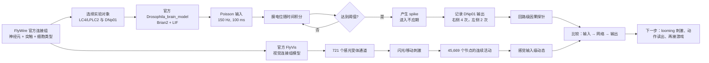

# 果蝇大脑实验阶段性汇报

## 一句话结论

我们已经把“静态连接组如何被使用”拆成了两个可运行层次：

1. 用官方 `Drosophila_brain_model` 对选定的 LC4/LPLC2→DNp01 回路做直接刺激，验证连接组可以被转换为随时间放电的 LIF 网络。
2. 用官方 `FlyVis` 预训练视觉模型从 721 个感光受体输入开始，观察视觉刺激如何在视觉网络中传播到 45,669 个节点。

这说明：连接组本身只是“谁连接谁”；要研究“怎么用”，还必须指定刺激、神经动力学和输出读出方式。

## 给师兄汇报的流程图

## 已完成的实验

### 1. 官方 LIF 局部回路

- 数据：官方 FlyWire v783 连接组表。
- 回路：5 个 LC4、5 个 LPLC2，连接到左右 DNp01 的直接边。
- 刺激：对选定输入神经元施加 150 Hz Poisson spike 输入，模拟 100 ms。
- 动力学：使用官方仓库的 LIF 参数和 Brian2 实现，没有改写核心方程。
- 输出：右侧 DNp01 记录 4 个 spike，第一次约 10.5 ms；左侧记录 2 个 spike，第一次约 32.3 ms。
- 含义：这是一个“连接是否能把人工输入传到下游”的可重复因果测试，不等同于自然视觉行为。

可视化：`outputs/official_lif_circuit_3d.gif`

### 2. 官方 FlyVis 视觉模型

- 输入：721 个感光受体/视觉输入通道。
- 网络：45,669 个节点，使用官方预训练结果。
- 刺激：对输入施加短时全场亮度脉冲。
- 结果：刺激期间网络平均活动升高，撤去刺激后回落。
- 含义：这是“感光输入如何经过视觉网络产生动态活动”的感觉层实验。

## 如何解释两个模型的关系

FlyVis 不是“在 Brian2 上接一个摄像头”。两者都使用果蝇连接组约束网络，但实现层不同：

- `Drosophila_brain_model`：Brian2 + LIF，实验中直接给指定神经元 Poisson 输入，适合做局部回路因果探针。
- `FlyVis`：PyTorch 视觉模型，从感光受体通道开始，使用预训练视觉网络参数，适合做视觉刺激到神经活动的映射。

因此，比较准确的说法是：FlyVis 把实验从“直接激活某些神经元”向“先给视觉刺激，再让视觉网络自行产生活动”推进了一层。

## 3D GIF 应该怎么讲

GIF 中：

- 蓝色节点：被人工刺激的 LC4；
- 橙色节点：被人工刺激的 LPLC2；
- 灰色连线：官方连接组中测得的输入到 DNp01 直接连接；
- 深红/亮红节点：DNp01；亮红表示当前时间窗内有 spike；
- 节点旁的数字：截至当前帧累计记录到的 spike 数。

它展示的是“回路结构 + 输出时间”的结合，不是全脑三维重建，也不是行为录像。这个边界在汇报时应主动说明。

## 建议的汇报顺序

1. 先展示静态连接组：输入神经元、DNp01 和实测连线。
2. 播放 GIF：说明同一回路在 LIF 时间积分下出现 DNp01 spike。
3. 展示 FlyVis：说明更上游的感光输入也可以驱动网络活动。
4. 强调目前还没有加入：自然 looming 编码、身体/动作闭环、多巴胺调制、突触可塑性。
5. 下一步只做一个最小扩展：把 FlyVis 的一个简单视觉刺激输出，与 LIF 回路的直接刺激结果并列比较。

## 当前实验的边界

本阶段证明的是“连接组 + 动力学 + 人工输入 + 输出读出”这条链路已经跑通。它还没有证明：

- LC4/LPLC2 在自然视觉场景下必然产生某个行为；
- 模型已经重现完整逃逸行为；
- 多巴胺或学习机制已经被实现；
- FlyVis 输出已经自动变成游戏中的动作。

